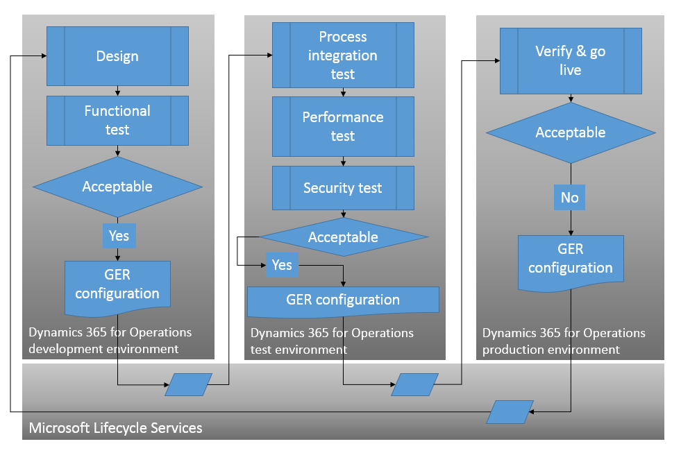

---
# required metadata

title: Manage the Electronic reporting (ER) configuration lifecycle
description: This topic describes how to manage the lifecycle of Electronic reporting (ER) configurations for the Microsoft Dynamics 365 for Finance and Operations solution.
author: NickSelin
manager: AnnBe
ms.date: 06/20/2017
ms.topic: article
ms.prod: 
ms.service: dynamics-ax-platform
ms.technology: 

# optional metadata

ms.search.form: ERDataModelDesigner, ERMappedFormatDesigner, ERModelMappingDesigner, ERModelMappingTable, ERSolutionImport, ERSolutionTable, ERVendorTable, ERWorkspace
# ROBOTS: 
audience: Application User, Developer, IT Pro
# ms.devlang: 
ms.reviewer: kfend
ms.search.scope: Core, Operations
# ms.tgt_pltfrm: 
ms.custom: 58801
ms.assetid: 35ad19ea-185d-4fce-b9cb-f94584b14f75
ms.search.region: Global
# ms.search.industry: 
ms.author: nselin
ms.search.validFrom: 2016-02-28
ms.dyn365.ops.version: AX 7.0.0

---

# Manage the Electronic reporting (ER) configuration lifecycle

[!include [banner](../includes/banner.md)]

This topic describes how to manage the lifecycle of Electronic reporting (ER) configurations for the Microsoft Dynamics 365 for Finance and Operations solution.

## Overview

Electronic reporting (ER) is an engine that supports statutory required and country-specific electronic documents in Microsoft Dynamics 365 for Finance and Operations. In general, ER assumes an ability to perform the following tasks for a single electronic document. For more details, see [Electronic reporting overview](general-electronic-reporting.md).

- Design a template for an electronic document:

    - Identify the required sources of data that can be presented in the document:

        - Underlying Finance and Operations data, such as data tables, data entities, and classes.
        - Process-specific properties, such as execution date and time, and time zone.
        - User input parameters, specified by the end user at run time.

    - Define the required document elements and their topology to specify a final document format.
    - Configure the desired flow of data from selected data sources to defined document elements (via data source bindings to document format components), and specify process control logic.

- Make a template available so that it can be used in other Finance and Operations instances:

    - Transform a document template that was created in Finance and Operations into an ER configuration, and export the configuration from the current Finance and Operations instance as an XML package that can be stored either locally or in LCS.
    - Transform an ER configuration into a Finance and Operations document template.
    - Import an XML package that is stored either locally or in LCS into the current Finance and Operations instance.

- Customize the template of an electronic document:

    - Bring a template from LCS into the current Finance and Operations instance as an ER configuration.
    - Design a custom version of an ER configuration, and keep a reference to the base version.

- Integrate a template with a particular business process, so that it's available in Finance and Operations:

    - Configure settings so that Finance and Operations starts to use an ER configuration, by referring to that configuration in a process-related parameter. For example, refer to the ER configuration in a specific Accounts payable payment method to generate an electronic payment message for processing invoices.

- Use a template in a specific business process:

    - Run an ER configuration in a specific business process. For example, to generate an electronic payment message for processing invoices when a payment method that references the ER configuration is selected.

## Concepts
The following roles and related activities are associated with the ER configuration lifecycle.

| Role                                       | Activities                                                      | Description |
|--------------------------------------------|-----------------------------------------------------------------|-------------|
| Electronic reporting functional consultant | Create and manage ER components (models and formats).           | A business person who designs ER domain–specific data models, designs the required templates for electronic documents, and binds them accordingly. |
| Electronic reporting developer             | Create and manage data model mappings.                          | A Finance and Operations specialist who selects the required Finance and Operations data sources and binds them to ER domain–specific data models. |
| Accounting supervisor                      | Configure process-related settings that reference ER artifacts. | For example, an **Accounting supervisor** role that allows the settings of an ER configuration to be used in a particular Accounts payable payment method to generate an electronic payment message for processing invoices. |
| Accounts payable payments clerk            | Use ER artifacts in a specific business process.                | For example, an **Accounts payable payments clerk** role that allows electronic payment messages to be generated for processing invoices, based on the ER format that is configured for a specific payment method. |

## ER configuration development lifecycle
For the following ER-related reasons, we recommend that you design ER configurations in the development environment, as a separate instance of Finance and Operations:

- Users in either the **Electronic reporting developer** role or the **Electronic reporting functional consultant** role can edit configurations and run them for testing purposes. This scenario can cause calls of methods of classes and tables that might harm business data and the performance of the Finance and Operations instance.
- Calls of methods of classes and tables as ER data sources of ER configurations aren't restricted by Finance and Operations entry points and logged company content. Therefore, users in either the **Electronic reporting developer** role or the **Electronic reporting functional consultant** role can access business-sensitive data.

ER configurations that are designed in the development environment can be uploaded to the test environment for the configuration evaluation (proper process integration, correctness of results, and performance) and quality assurance, such as correctness of role-driven access rights and segregation of duties. The features that enable ER configuration interchange can be used for this purpose. Finally, proven ER configurations can be uploaded either to LCS, where they can be shared with service subscribers, or to the production environment for internal use, such as shown in the following illustration.

## Additional resources

[Electronic reporting overview](general-electronic-reporting.md)
