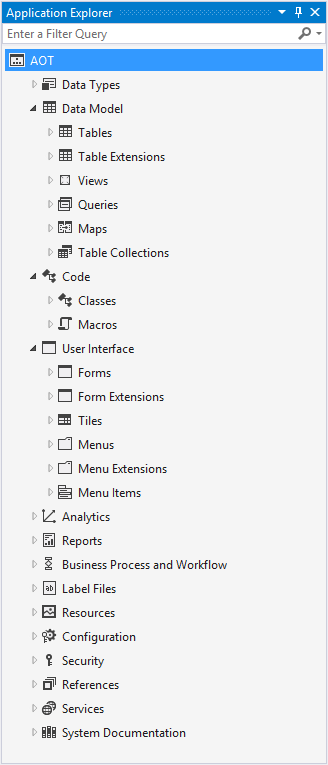
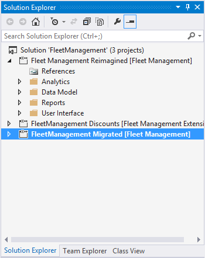
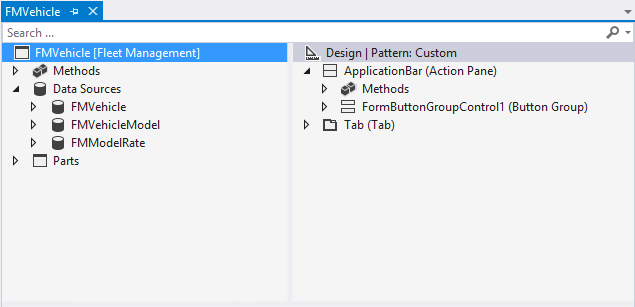
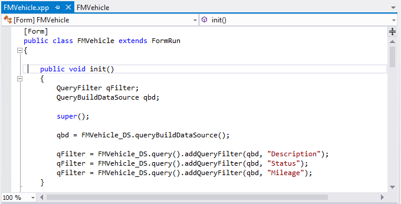

---
# required metadata

title: Development tools in Visual Studio
description: Visual Studio 2015 is the exclusive integrated development environment (IDE) for development.
author: robadawy
manager: AnnBe
ms.date: 05/24/2017
ms.topic: article
ms.prod: 
ms.service: dynamics-ax-platform
ms.technology: 

# optional metadata

# ms.search.form: 
# ROBOTS: 
audience: Developer
# ms.devlang: 
ms.reviewer: robinr
ms.search.scope: Operations
# ms.tgt_pltfrm: 
ms.custom: 23401
ms.assetid: 
ms.search.region: Global
# ms.search.industry: 
ms.author: robadawy
ms.search.validFrom: 2016-02-28
ms.dyn365.ops.version: AX 7.0.0

---

# Development tools in Visual Studio

[!include [banner](../includes/banner.md)]

## What are the development tools?
A notable change from Microsoft Dynamics AX 2012 is that Microsoft Dynamics 365 for Finance and Operations does not include a rich-client application (ax32.exe). From a development perspective, this means that the Microsoft Dynamics AX 2012 development environment, MorphX, is no longer used. In its place, the application development is carried out exclusively in Visual Studio. The development tools support all of the development tasks, including debugging and local testing scenarios. A primary goal of the development experience is to keep familiar Microsoft Dynamics AX 2012 concepts, and seamlessly adapt them to the Visual Studio framework and paradigms.

Visual Studio 2015 is the exclusive integrated development environment (IDE) for development. All of your application development work will be performed with it. This section is an overview of the main features that are added to Visual Studio when the development tools are installed.

### Application Explorer
In Visual Studio, the model store is represented by the Application Explorer. On the **View** menu, click **Application** **Explorer** to open it. The Application Explorer corresponds to the Application Object Tree (AOT) that you may be familiar with in Microsoft Dynamics AX 2012. Use the Application Explorer to browse and interact with the elements in the model store that define the applications. The following illustration shows the Application Explorer. For more details, see [Application Explorer](application-explorer.md).

### The project template
Even a simple application can have a large number of elements in its model. The **Operations Project** template has been added to Visual Studio to help you organize and manage the elements that you are working with for a model. You will use the project to design, build, and test model elements. It’s common to have several projects within a single Visual Studio solution. The following illustration shows three projects in a Visual Studio solution. For more details, see [Projects](projects.md).

### Element designers
The Visual Studio tools contain designers for each kind of element in the application. You will use these designers when you create or modify elements. The following illustration shows the element designer for a form element. For more details, see [Element designers](element-designers.md).

### Code editor
The X++ code is written in the code editor for Visual Studio. The standard features that a developer expects from the code editor are supported. For example, sections of code are collapsible. IntelliSense provides guidance as you write or modify code. For more details, see [Code editor](code-editor.md).

### Dynamics 365 menu
The tools add the **Dynamics 365** menu to Visual Studio. Several tools that you will use during the development process are found here. For example, the tools for managing models are accessed from the menu.

