---
# required metadata

title: End-to-end scenario for the Fleet Management sample application
description: This tutorial walks you through an end-to-end scenario that the Fleet Management sample application is designed to support.
author: RobinARH
manager: AnnBe
ms.date: 11/03/2017
ms.topic: article
ms.prod: 
ms.service: dynamics-ax-platform
ms.technology: 

# optional metadata

# ms.search.form: 
# ROBOTS: 
audience: Developer
# ms.devlang: 
ms.reviewer: robinr
ms.search.scope: Operations
# ms.tgt_pltfrm: 
ms.custom: 10254
ms.assetid: e289504e-a1d9-44b7-8f84-f99f330321d6
ms.search.region: Global
# ms.search.industry: 
ms.author: robadawy
ms.search.validFrom: 2016-02-28
ms.dyn365.ops.version: AX 7.0.0

---

# End-to-end scenario for the Fleet Management sample application

[!include [banner](../includes/banner.md)]

This tutorial walks you through an end-to-end scenario that the Fleet Management sample application is designed to support.

In this tutorial, you’ll take a tour of the Fleet Management sample. The overviews in this tutorial provide some background knowledge and contextual info. You’ll walk through an end-to-end scenario that this sample application is designed to support. This is information that you should have before proceeding to other tutorials.

## Prerequisite
-   You must first be provisioned as an end user before you start this tutorial.
-   This tutorial mainly explores the FleetManagement Migrated project and the application that it builds.

## Installing the demo data
To work with the sample, you must install the provided demo data.

1.  In the VM, open Internet Explorer and navigate to the application's base URL.
2.  Sign in.
3.  On the dashboard, open the navigation pane and go to **Fleet Management &gt; Setup &gt; Fleet setup**. 

    [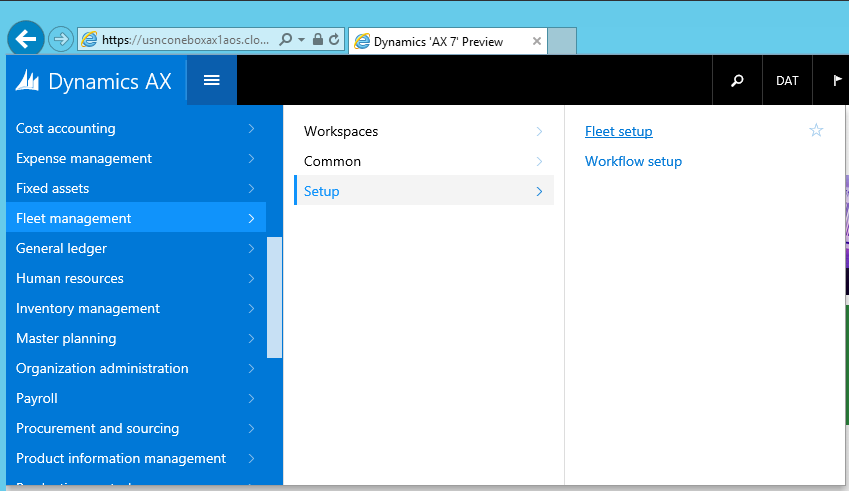](./media/fleetsetup1_introfleetmgmt1.png)

4.  Click **Setup Demo Data**. 

    [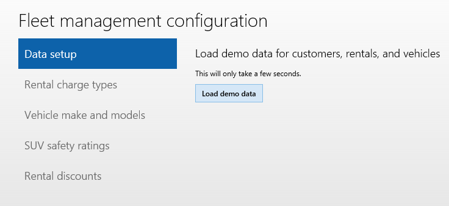](./media/loaddemodata_introfleetmgmt1.png)

5.  If you're prompted to reload the demo data, click **Yes**.
6.  When the data is finished loading, click **Close**.

## Use the Fleet Management application to rent a vehicle
Keep in mind that you’re working with the migrated app in this section. The forms that you see are directly ported from the Microsoft Dynamics AX 2012 version of the sample. Although they have been modified and restyled, they have not been reimagined.

1.  Open Internet Explorer, and sign into Microsoft Dynamics 365 for Finance and Operations.
2.  To return to the **Dashboard**, click the Microsoft Dynamics logo in the top-left corner of the page. The dashboard is the main working hub. You can see the various tiles, organized into sections, which lead to parts of the application. The dashboard is designed for horizontal scrolling, which is an optimization for working well on modern devices. The button to the right of the dashboard shows the navigation bar.
3.  From the Dashboard, open the navigation bar and go to **Fleet Management** &gt; **Common** &gt; **Customers** &gt; **Customer**. 

    [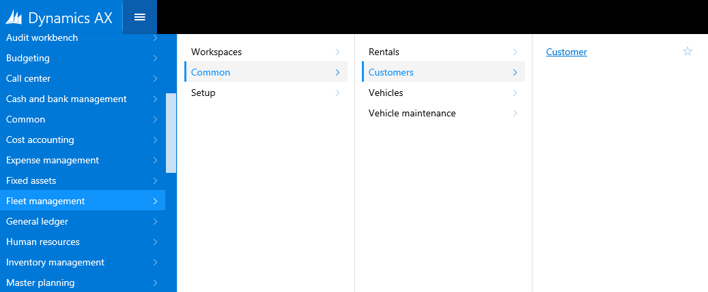](./media/customers_introfleetmgmt.png) 

    [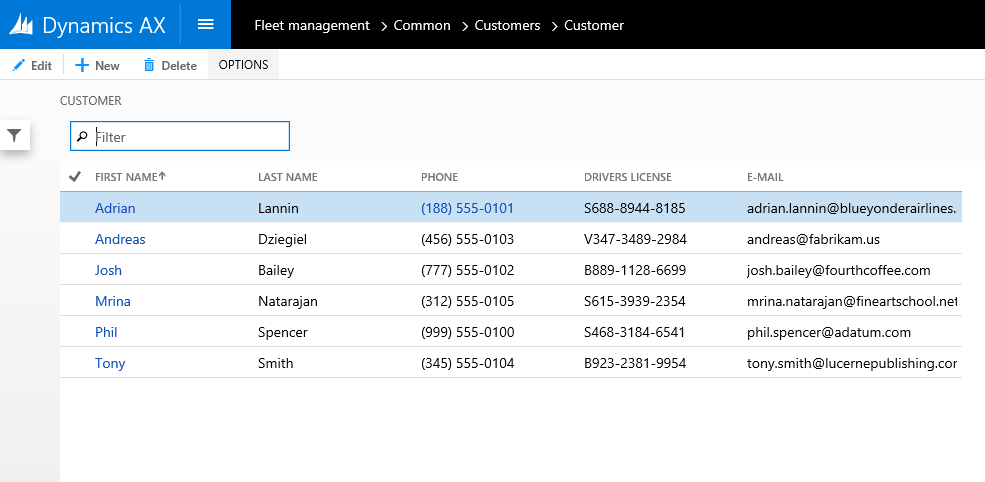](./media/newcustomer_introfleetmgmt1.png)

4.  On the Action Pane, click the Microsoft Office logo, then click on **Customers** under **Export to Excel **to send the information in the grid view to a Microsoft Excel spreadsheet. This operation can take some time.

    [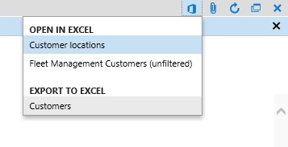](./media/exporttoexcel.jpg)

5.  When prompted, click **Open** to view the data in Excel.
6.  Close Excel.
7.  To switch to the **Details** view, click on a value in the **First Name** column. 

    [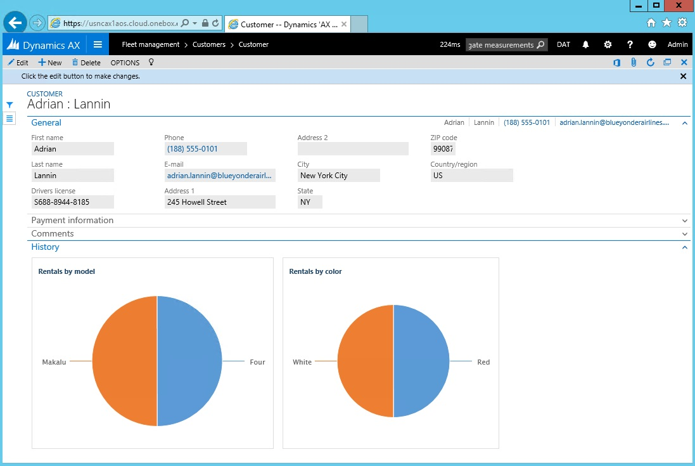](./media/customer.jpg) This view shows detailed information for a single customer.

8.  Click **Show list** to show the navigation list. 

    [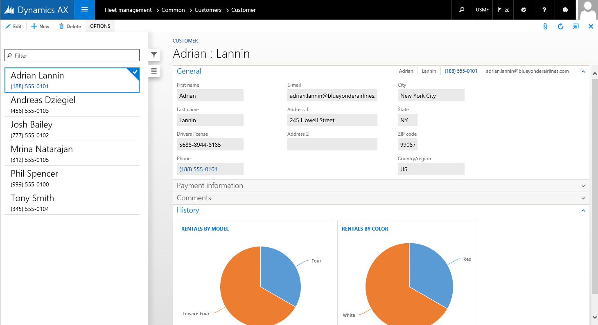](./media/listnav_introfleetmgmt1.png)

9.  Click the various customer names in the navigation list in the side pane, and watch as the detailed information about each customer changes.
10. Select the customer **Phil Spencer**. You'll notice the charts update to indicate Phil's previous rental preferences.
11. Hover over the pie slices to see the details. You'll notice that, in the past, Phil has often rented red SUVs. This might give the sales clerk a cue to look for available red SUVs the next time Phil makes a reservation. This is a simple example of proactively providing insights.
12. Add yourself as a customer.
    -   On the Action Pane, click **New**. 

        

    -   Fill in the form to add yourself as a customer. Make sure that you provide your name, a 16-digit number in the credit card field, and address information, at a minimum. **Note**: You don't have to take any action to save a new record.

13. Create a new rental.
    1.  On the navigation bar, go to **Fleet management** &gt; **Rentals** &gt; **Rental**.
    2.  In the **Rental** form, on the Action Pane, click **New.**
    3.  In the **Vehicle** field, select a vehicle.
    4.  In the **Customer** field, select your name.
    5.  In the **To** field, pick an end date.
    6.  In the **Start** field, enter “35,000”.
    7.  In the **Pickup** field, enter Full.
    8.  When you are done, click **Save**.

14. Start the rental period.
    1.  On the Action Pane, click **Start rental**.
    2.  In the dialog box, verify the values in the fields and click **OK**.

## Use Fleet Management to run a workflow
1.  Click the Dynamics icon to return to the dashboard.
2.  Find the **Reservation Management** tile and click on it to open the Reservation Management workspace.
3.  Click **Current rentals**.
4.  On the **Rentals** form, click the ID of your rental.
5.  On the Details view of the **Rentals** form, on the Action Pane, click **Complete rental**.
6.  In the **New mileage** field, enter 40,000, and then click **OK**.
7.  Click the Dynamics icon to return to the dashboard.
8.  On the navigation bar, navigate to **Fleet management** &gt; **Vehicles** &gt; **Vehicle Maintenance**. 

     

    In the **Vehicle Maintenance** form, the **Status** field shows that your rental is awaiting examination by the service department. **Note**: You might need to wait up to two minutes for the batch framework to change the status of the vehicle. On the Action Pane, click **Refresh** periodically to update the view, until you see the status change. Keep in mind that a different person usually handles each step in a workflow; the brief delay introduced by the batch framework is not an issue in a real-world application.
9.  Select the row that contains your rental. On the Action Pane, click **Workflow**, and then click **Examination complete**. **Note**: You may need to refresh the page to get the full set of options under Workflow.
10. Enter a comment, and then click **Examination complete**.
11. You might again need to wait up to two minutes for the batch framework to process the change. On the Action Pane, click **Refresh** periodically, until you see the **Status** field change. Notice that the vehicle now has a status of **Awaiting Service**.
12. Optionally, you can continue to repeat these workflow steps to take the vehicle through the service and cleaning phases. After cleaning is completed, the final status is **Done**.
13. Click **Workflow**, and then click **View history**. The **Workflow history** form provides information about the vehicle workflow.
14. Click **Tracking details** to see the activities. [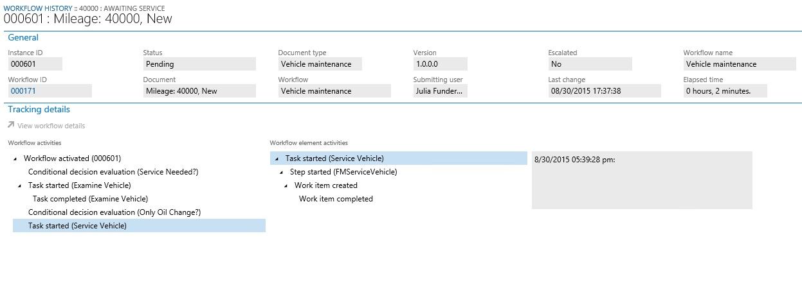](./media/workflow.jpg)

### To view the setup behind the workflow

1.  On the dashboard, navigate to **Fleet Management** &gt; **Setup** &gt; **Workflow setup**. The **Workflow Setup** page shows the list of workflows. 

    

2.  In the **Workflow ID** column, click the ID of your vehicle maintenance workflow.
3.  Accept any prompts that ask you for permission to run code. After a short wait, the workflow editor opens. **Note:** This step works on the one-box environment, but not in the cloud. You can view the workflow diagram in the workflow editor. The following illustration shows the workflow.

    [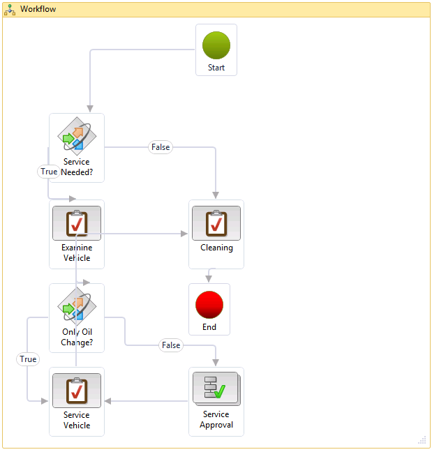](./media/workflow_introfleetmgmt.png)

4.  When you are done, close the **Workflow** window.

## Create a new KPI definition
The web client enables users who have appropriate permissions to modify KPI definitions that have been modeled and deployed by developers. Users also have the ability to create new KPI definitions in the client. In this walkthrough, you create a new KPI definition in the client.

1.  Open the **Reservation Management** workspace. On the navigation bar, go to** Fleet Management **&gt;** Workspaces &gt; Reservation Management**.
2.  Notice the Total revenue KPI tile shown on the bottom left of the workspace. Click the **Total Revenue KPI** tile. Details of the total revenue KPI tile along with charts indicating top and bottom contributors to revenue will be shown on screen.
3.  Next, you will define a new KPI to monitor the number of rentals.
4.  On the Action Pane, click **New**. The **New KPI** dialog will open.
5.  Enter following values for the new KPI definition.

    | **Field**         | **Value**               |
    |-------------------|-------------------------|
    | **Name**          | Number of Rentals       |
    | **Measurement**   | FMAggregateMeasurements |
    | **Measure Group** | FmRentalCharges         |
    | **Measure**       | NoRentals               |
    | **Goal is**       | Fixed Value             |
    | **Goal Value**    | 30                      |

6.  Click **Save**. 

    [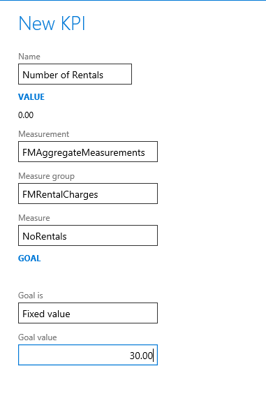](./media/newkpi_introfleetmgmt1.png) 

    **Note:** If the **Save** button isn’t visible in the **New KPI** dialog box, use a higher screen resolution so that you can see the entire dialog. You can see the KPI details page that contains details about the KPI that you created. You can make changes in the **Details** section. You will modify the default threshold values so that if the value is less than 90% of the goal, the KPI will show red and if the value is over 110% of the goal, the KPI will show green.
7.  Click **Edit**.
8.  Scroll to the right of the screen, and modify the values in the thresholds fields as follows.

    | **Property**           | **Value** |
    |------------------------|-----------|
    | **Red if less than**   | 90        |
    | **Green if more than** | 110       |

9.  In the application bar, click **Save 

    [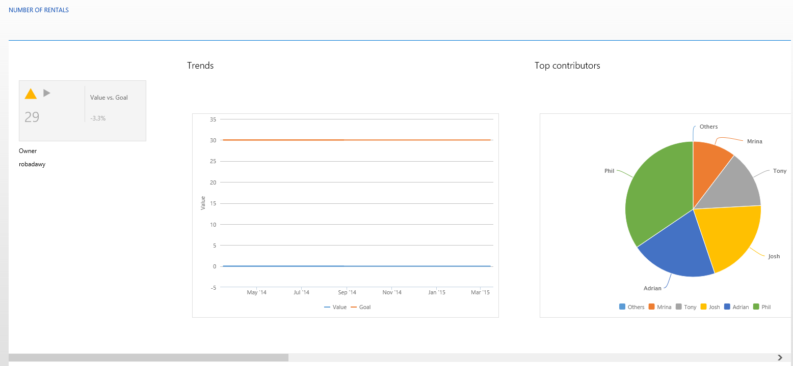](./media/kpigraph_introfleetmgmt.png)**

10. Click the form caption to return to the grid view.
11. Click the **Name** column header, change the filter operator to **contains**, and update the filter field value to **Number**. You will see the new KPI is available in the list.

    

## Launch an operational report
In this tutorial, you’ll launch an operational report that contains a list of customers who are currently renting vehicles.

1.  Use the dashboard to open the **Reservation management** workspace.
2.  Click the **Customers report** tile. Do not enter anything in the parameter for **Customer group**. 

    [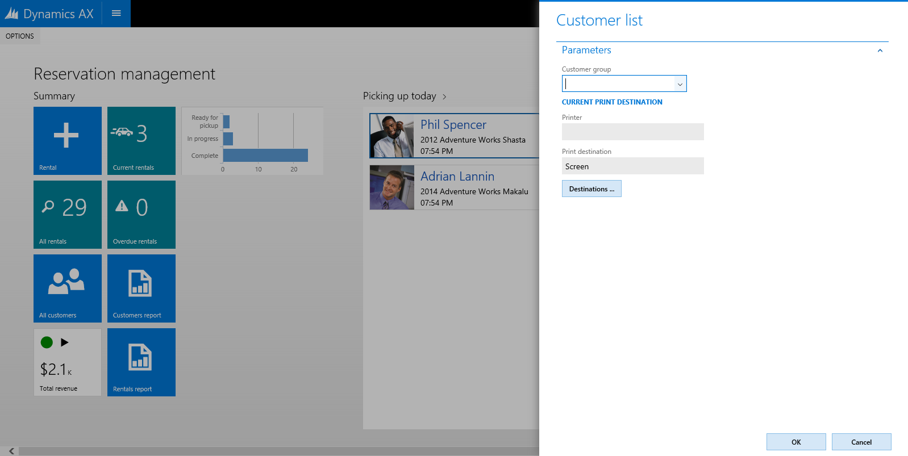](./media/customerlist_introfleetmgmt1.png)

3.  Click **OK** to close the dialog box. The report will be rendered and show the list of customers. The report may take a minute to render.

## Secure access using the role-based security system
In this tutorial, you’ll access the system as a user that has been assigned a different security role. This tutorial requires that you have created at least one additional end user.

1.  On the dashboard, in the **System administration** section, click **Users**.
2.  On the Action Pane, click **New**.
3.  Enter the following field information.

    | **Property**        | **Value**                                                                                 |
    |---------------------|-------------------------------------------------------------------------------------------|
    | **User ID**         | Eight character unique ID                                                                 |
    | **User name**       | The first name of the user                                                                |
    | **Network domain**  | urn:Federation:MicrosoftOnline                                                            |
    | **Alias**           | <tim@lucernepublishers.ccsctp.net> (Replace with the organization account email address.) |
    | **Default Company** | DAT                                                                                       |
    | **Enabled**         | Verify that this slider is set to **Yes**.                                                |

4.  Click **Assign Roles**. 

    [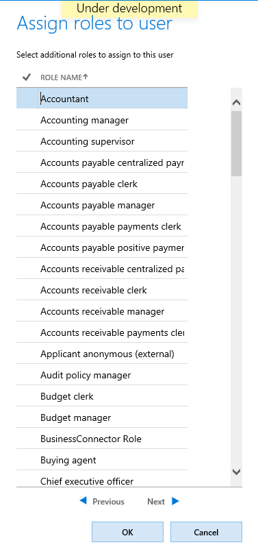](./media/assignroles_introfleetmgmt.png)

5.  Select **Fleet management branch manager**, and then click **OK**.
6.  Click the user name on the top right, and then click **Sign Out**. You’ll be redirected back to the sign-n page
7.  Sign in using the credentials for the user who you assigned the security role to in the steps above.
8.  Notice that in the dashboard, this user can see only items that are related to his security role. Items that system administrators can see are now hidden.
9.  Click **Sign out** to sign out of the session.

