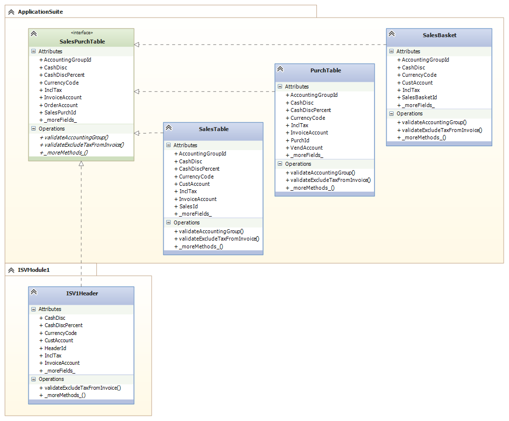
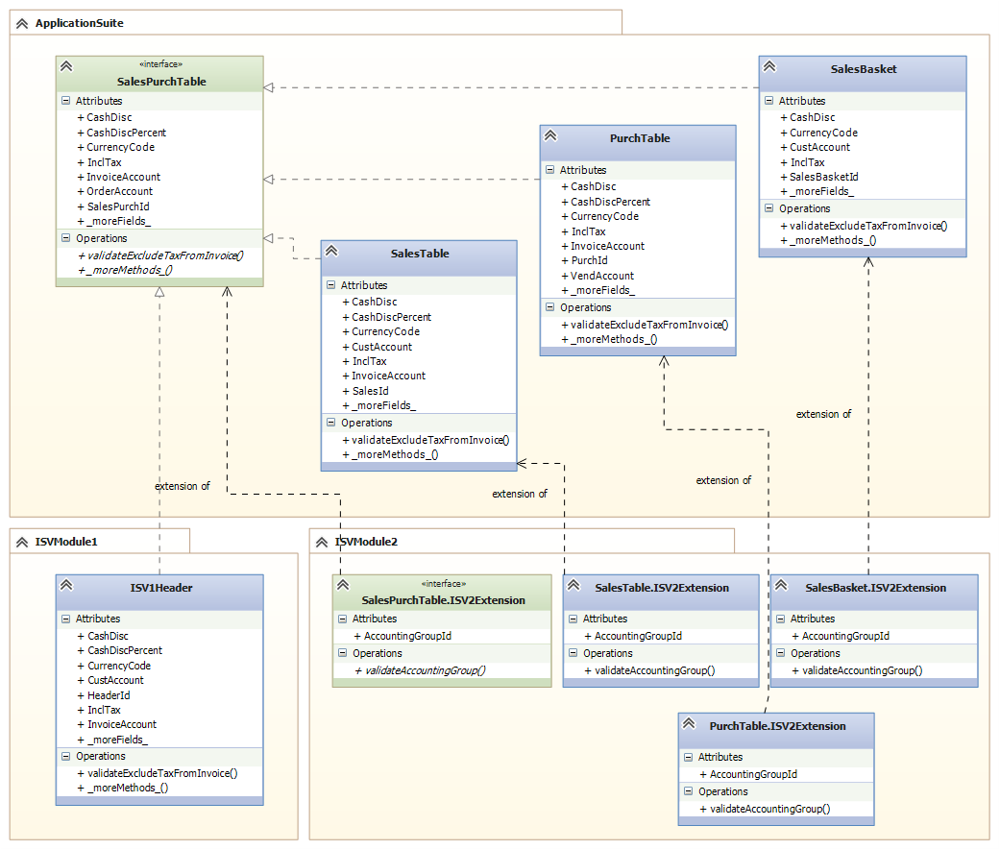

---
# required metadata

title: Table map extension
description: To extend table maps, we have refactored table maps into a model, which allows you to extend a solution with additional fields and methods. 
author: LarsBlaaberg
manager: AnnBe
ms.date: 12/20/2017
ms.topic: article
ms.prod: 
ms.service: dynamics-ax-platform
ms.technology: 

# optional metadata

# ms.search.form: 
# ROBOTS: 
audience: Developer
# ms.devlang: 
ms.reviewer: robinr
ms.search.scope: Operations
# ms.tgt_pltfrm: 
ms.custom: 89563
ms.assetid: 
ms.search.region: Global
# ms.search.industry: 
ms.author: lolsen
ms.search.validFrom: 2017-07-01
ms.dyn365.ops.version: Platform update 11
---

# Table map extension

[!include [banner](../includes/banner.md)]

This topic applies to Dynamics 365 for Finance and Operations, Enterprise edition 7.3 and later.

To extend table maps, we have refactored table maps into a model, which allows you to extend a solution with additional fields and methods. This topic discusses why you need a model to extend a table map.

Adding a field to an existing table map through extension can present some challenges. If these issues are not addressed during the implementation, there can be runtime errors. The errors occur because the developer cannot modify all the tables that are involved in implementing the table map. The same is true for adding a method to a table map if the method is called directly as an instance method on the table map. There is no way to enforce how fields on table maps must be mapped to fields on all tables that implement the table map. Similarly, there is no way to enforce how methods on table maps must be also be methods on all tables that implement the table map.

The following diagram shows the **SalesPurchTable** table map, which is implemented by the **SalesTable**, **PurchTable**, and **SalesBasket** tables in the **ApplicationSuite** model. In addition, the **ISV1Header** table implements the **SalesPurchTable** table map, but **ISV1Header** is part of an **ISVModule1** model.

For example, if a new field named **AccountingGroupId** and a new method named **validateAccountingGroup** are added to the table map in the **ApplicationSuite** model, then the tables that you implement the table map can be updated to include the field and method added as well. The **ISV1Header** table in the **ISVModule1** model is, however, outside of the control of the developer making the changes to the **ApplicationSuite** model.

If you add business logic to the **ApplicationSuite** model, and that logic queries the new **AccountingGroupId** field and the table map record is of type **ISV1Header**, a runtime error occurs.

        SalesPurchTable      headerTable;
        ...
        ...
        if (headerTable.AccountingGroupId)

Similarly, if you add business logic to the **ApplicationSuite** model, and that logic queries **validateAccountingGroup**, then a runtime error occurs.

        SalesPurchTable      headerTable;
        ...
        ...
        if (headerTable.validateAccountingGroup())

As a result, the solution is broken, unless you add mapping to the new field and add the new method to the **ISV1Header** table. 

The conflict is not resolved if the ability to add fields or methods is added to table maps through extension. This is illustrated in the following diagram, where **ISVModule2** includes extensions of the table map and the implementing tables in the **ApplicationSuite** model. The developer implementing **ISVModule2** has no control over the **ISV1Header** table in the **ISVModule1** model, so the **ISV1Header** table lacks a mapping of the **AccountingGroupId** field and implementation of the **validateAccountingGroup** method.

Even if the the compiler enforced that all fields and methods on a table map must be mapped to all tables implementing the table map, the conflict would not be resolved. Instead of receiving runtime errors, adding a field or a method would clear a breaking change, as tables not having a new field mapped or a new method implemented would compile when the model containing the added field/method is applied. To extend table maps, we have refactored table maps into a model, which allows you to extend a solution with additional fields and methods.

