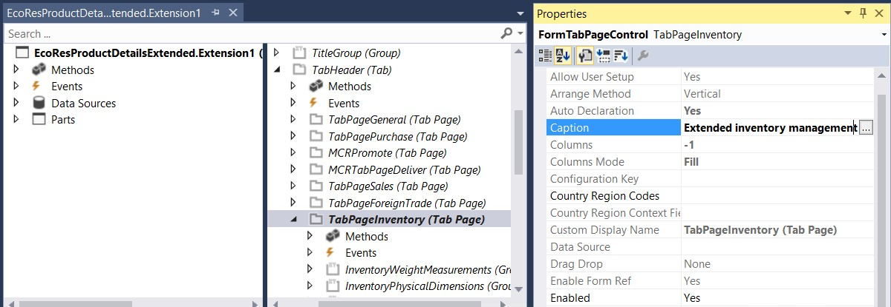
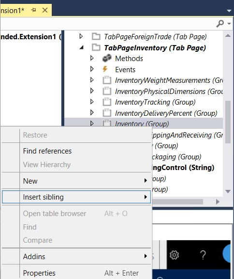
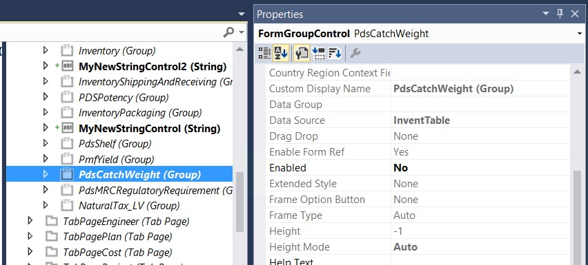
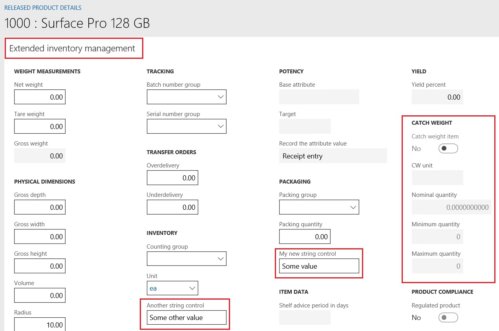

---

# required metadata

title: Modify the properties of form controls through extension
description: This topic explains how you can modify the properties of a control by using an extension.
author: ivanv-microsoft
manager: AnnBe
ms.date: 07/10/2017
ms.topic: article
ms.prod: 
ms.service: dynamics-ax-platform
ms.technology: 

# optional metadata

# ms.search.form: 
# ROBOTS: 
audience: Developer
# ms.devlang: 
ms.reviewer: robinr
ms.search.scope: Operations
# ms.tgt_pltfrm: 
ms.custom: 268724
ms.assetid: 
ms.search.region: Global
# ms.search.industry: 
ms.author: ivanv
ms.search.validFrom: 2017-02-28
ms.dyn365.ops.version: Platform update 4

---

# Modify the properties of form controls through extension

[!include [banner](../includes/banner.md)]

Often, the way that users interact with the application requires modification. Typically, you hide or disable controls on the page, replace standard labels with labels that are more appropriate, or even add new controls that the user requires. You can also create a form extension. 

> [!TIP]
> You can achieve even more flexibility through event subscription on form control events. This approach is discussed in other topics. In this topic, the focus is on metadata changes.

## Example

The customer requires changes to the **Manage inventory** FastTab on the **Released product details** page. You must change the label of the FastTab, disable the field group that shows the catch weight configuration, and add new controls. (For this example, the new controls aren't bound to existing fields in the data source).

Follow these steps to make the required changes.

1. In the extension model, create an extension of the **EcoResProductDetailsExtended** form.
2. Navigate through the form design tree to the **TabPageInventory** tab page (**Design** &gt; **Tab** &gt; **Details** &gt; **GroupDetails** &gt; **TabHeader** &gt; **TabPageInventory**), select it in the designer, and open the **Property** sheet.
3. Update the **Caption** property to the desired value.

    

4. Right-click the tab page, and then select **New**. Set the required properties on the new control. You can also move the control up and down in the immediate container to position it correctly.

    > [!NOTE]
    > Alternatively, right-click the subnode that the new control should appear after, select **Insert sibling**, and then select the type of control to add.

    

    Of course, you can just drag bound controls over from the corresponding data source.

5. Select the **PdsCatchWeight** group control, and change the **Enabled** property to **No**.

    

    > [!NOTE]
    > If you change metadata properties such as **Enabled** and **Visible**, there is no guarantee that the control will stay in that state at runtime. After a form is loaded, business logic on that form can change the state of controls through code.

When you've finished, the page includes additional fields, catch weight information can't be edited, and the whole FastTab has a different caption. 

> [!NOTE]
> You can't modify the **AutoDeclaration** property on controls. However, you can still access the controls by name from code. 
