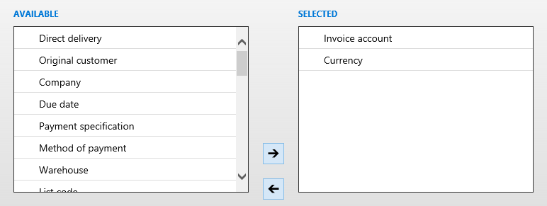
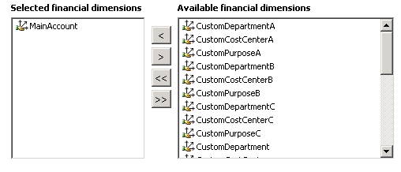

---
# required metadata

title: List Panel subpattern
description: This article provides information about the List Panel form subpattern. Application teams use this subpattern to manage two lists that move data between each other.
author: jasongre
manager: AnnBe
ms.date: 06/20/2017
ms.topic: article
ms.prod: 
ms.service: dynamics-ax-platform
ms.technology: 

# optional metadata

# ms.search.form: 
# ROBOTS: 
audience: Developer
# ms.devlang: 
ms.reviewer: robinr
ms.search.scope: Operations
# ms.tgt_pltfrm: 
ms.custom: 12433
ms.assetid: 81df4016-d7b9-4376-8a78-bdd435d686f6
ms.search.region: Global
# ms.search.industry: 
ms.author: jasongre
ms.search.validFrom: 2016-02-28
ms.dyn365.ops.version: AX 7.0.0

---

# List Panel subpattern

[!include [banner](../includes/banner.md)]

This article provides information about the List Panel form subpattern. Application teams use this subpattern to manage two lists that move data between each other.

Usage
-----

List Panel is the subpattern that application teams use to manage two lists that move data between each other. This pattern is meant to represent a modeled version of the **SysListPanel** class (programmatic) approach of managing two lists that move data between each other. The List Panel subpattern can be applied on the following controls:

-   TabPage control
-   Group control

## Wireframe

## Pattern changes
Here are the main changes to this pattern since Microsoft Dynamics AX 2012:

-   List (Grid/ListView) and Tree controls are supported.
-   The right panel is the selected section.
-   The left panel is the available section.
-   Six buttons are available as actions:
    -   Add
    -   Remove
    -   Add All (Optional)
    -   Remove All (Optional)
    -   Move Up (Optional)
    -   Move Down (Optional)

## Model
### High-level structure

- \[Container\]

    - *CustomFilterGroup (Group) \[Optional\]*
    - ListPanelGroup (Group)

        - AvailablePanel (Group)

            - Grid | Tree | ListView | ListBox

        - ActionPanel (Group)

            - AddButton (Button)
            - RemoveButton (Button)
            - *AllAllButton (Button) \[Optional\]*
            - *RemoveAllButton (Button) \[Optional\]*

        - SelectedPanel (Group)

            - Grid | Tree | ListView | ListBox\*

        - *MoveUpDownPanel \[Optional\]*

            - MoveUpButton (Button)
            - MoveDownButton (Button)

### Core components

-   Apply the ListPanel subpattern to the container (TabPage or Group) control.
-   Address BP Warnings:
    -   No additional BP checks are required beyond the AX6.3 BP checks that were carried forward.

## UX guidelines
The verification checklist shows the steps for manually verifying that the form complies with UX guidelines. This checklist doesn't include any guidelines that will be enforced automatically through the development environment. Open the form in a browser, and walk through these steps.

-   **Standard form guidelines:**
    -   Standard form guidelines have been consolidated into the [General Form Guidelines](general-form-guidelines.md) document.

## Examples
Form: **CLIPatterns\_ListPanel** **(FormTabPageControl1)** 

 

Form: **SalesSummaryParameters (GroupQuotation)** 

## Resources
### Typically used by patterns

-   [Simple List and Details](simple-list-details-form-pattern.md)
-   [Table of Contents](table-of-contents-form-pattern.md)
-   [Details Master](details-master-form-pattern.md)
-   [Dialog](dialog-form-pattern.md)
-   [Wizard](wizard-form-pattern.md)

## Appendix
### Frequently asked questions

This section will have answers to frequently asked questions that are related to this guideline/pattern.

### Open issues

-   None

### AX 2012 content

