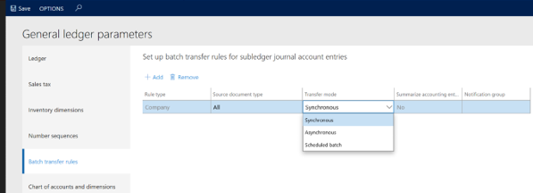
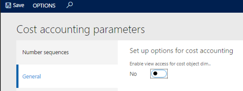

---
# required metadata

title: Demo data
description: This topic provides an overview of the demo data that is available for Microsoft Dynamics 365 for Finance and Operations.
author: sericks007
manager: AnnBe
ms.date: 07/05/2017
ms.topic: article
ms.prod: 
ms.service: dynamics-ax-platform
ms.technology: 

# optional metadata

# ms.search.form: 
# ROBOTS: 
audience: IT Pro
# ms.devlang: 
ms.reviewer: sericks
ms.search.scope: Operations
# ms.tgt_pltfrm: 
ms.custom: 56551
ms.assetid: d876e8de-d547-43e5-9259-f095821dc758
ms.search.region: Global
# ms.search.industry: 
ms.author: pmantha
ms.search.validFrom: 2016-02-28
ms.dyn365.ops.version: AX 7.0.0

---

# Demo data

[!include [banner](../includes/banner.md)]

This topic provides an overview of the demo data that is available for Microsoft Dynamics 365 for Finance and Operations.

Demo data is the base data set that is released together with Finance and Operations for implementation support and demonstration purposes. The current demo data set supports the following verticals:

- Retail
- Distribution
- Service Industries
- Public Sector
- Discrete & Process Manufacturing

The demo data set supports 40 languages across 16 countries or regions. It also supports various implementation scenarios. The following table lists the legal entities that are included in the demo data set.

| Legal entity | Description                          |
|--------------|--------------------------------------|
| BRMF         | Contoso Entertainment System Brazil  |
| CNMF         | Contoso Entertainment China          |
| DAT          | Default Company                      |
| DEMF         | Contoso Entertainment System Germany |
| FRRT         | Contoso Retail FR                    |
| FRSI         | Contoso Consulting FR                |
| GBSI         | Contoso Consulting GB                |
| GLCO         | Contoso Group                        |
| GLMF         | Contoso Entertainment System         |
| GLRT         | Contoso Retail                       |
| GLSI         | Contoso Consulting                   |
| INMF         | Contoso India                        |
| ITCO         | Contoso Italy                        |
| JPMF         | Contoso Entertainment Japan          |
| MXMF         | Contoso Entertainment System Mexico  |
| MYMF         | Contoso Entertainment System MYMF    |
| RUMF         | Contoso Entertainment System Russia  |
| RURT         | Contoso Retail RUS                   |
| US01         | Contoso US01                         |
| USMF         | Contoso Entertainment System USA     |
| USP2         | Contoso Orange Juice                 |
| USPI         | Contoso Process Industry             |
| USRT         | Contoso Retail USA                   |
| USSI         | Contoso Consulting USA               |

## Embedded analytics
Demo data has been updated in five companies to provide better reports on the new embedded analytics within workspace.  Filter the embedded analytics to the following legal entities for the improved report data:

| Legal entity | Description                           |
|--------------|---------------------------------------|
| DEMF         | Contoso Entertainment System Germany  |
| GLMF         | Contoso Entertainment                 |
| USMF         | Contoso Entertainment System USA      |
| USRT         | Contoso Retail USA                    |
| USSI         | Contoso Consulting USA                |

Reports from the Cash overview Power BI content are displayed in the **Cash overview** and **Bank management** workspaces. 

To view the Cash flow forecasting reports with data, you must first run the forecast calculation process using the **Calculate cash flow forecasts** function from the **Cash and bank management area**. This needs to be completed for each company included in the forecast. You then need to refresh the LedgerCovLiquidityMeasurement aggregate measure on the **Entity Store** page.

For demonstration purposes, you can add cash flow forecasting demo data using the **Generate data** page from the **Demo data** module. This script will insert data into the cash flow forecasting tables to quickly populate information necessary for reports. 

The credit and collections analytics can be viewed on the **Manage customer credit and collections** workspace. To view the analytics you need to refresh the CustCollectionsBIMeasurements aggregate measure on the **Entity Store** page.

The vendor payments analytics can be viewed on the **Vendor payments** workspace. To view the analytics, you need to refresh the VendPaymentBIMeasure aggregate measure on the **Entity Store** page.

The Purchase performance analytics can be viewed on the **Purchase spend analysis** page from the Procurement and sourcing module. To view the analytics, you need to refresh the Purchase cube aggregate measure on the **Entity Store** page.

The Sales and profitability analytics can be viewed on the **Sales and profitability performance** page from the Sales and marketing module. To view the analytics, you need to refresh the Sales cube aggregate measure on the **Entity Store** page.

The production performance analytics can be viewed on the **Production performance** page from the Production control module. To view the analytics, you need to refresh the Production cube aggregate measure on the **Entity Store** page.

For demonstration purposes, you can add production performance demo data using the **Generate data** page from the Demo data module. This script will generate production orders and with associated feedback journals to populate the production performance reports with data. 

The warehouse performance analytics can be viewed on the **Warehouse performance** page from the Warehouse management module. To view the analytics, you need to refresh the Warehouse aggregate measure on the **Entity Store** page.

For demonstration purposes, you can add warehouse performance demo data using the **Generate data** page from the Demo data module. This script will generate sales orders and warehouse work to populate the warehouse performance reports with data. 
The demo data module is only available if you have the Demo data suite model deployed on the environment.

## Vendor collaboration
In the USMF demo company, there are three purchase orders for vendor US-104 to use for demonstration purposes. You can log in as user ErinH, who is a contact person who has access to vendor collaboration for US-104.

## Purchase order approval 
In the USMF demo company, there are two purchase orders for INGA to approve. You can log in as user INGA to see the purchase orders awaiting approval. 

## Batch transfer rules for subledger journals
The batch transfer rules for subledger journal account entries have been changed to **Scheduled batch** to reflect a best practice. The batches are configured to run every 10 minutes. It is important to understand that accounting entries for all source documents will not be reflected in General ledger until the batch process has run. If you have requirements to see the immediate effect in General ledger, set the **Transfer mode** to **Synchronous** on the **Batch transfer rules** page within **General ledger** parameters. While Synchronous works well for product demos and environments with low transaction volumes, it can cause performance issues in larger transaction volume environments.  

## Cost accounting 
Three Cost accounting ledgers are created in demo data. The Cost accounting ledger USP2 provide an E2E demo experience based on data from legal entity USP2. The Cost control unit consist of 2 Cost object dimensions (Cost centers and Product groups). Actual cost, Budget cost and Statistical measures are transferred for all 12 fiscal periods of year 2017. Overhead calculation has also been performed for all fiscal periods of year 2017.

Access level security is configured but not enabled. This is enabled in the **Cost accounting parameters** page.

After Access level security has been enabled, you have assign Alica to the role Cost object controller. You can log in as Alica and access the **Cost control** workspace. Alicia can now see her Cost center performance and drill into details of how these was calculated.

