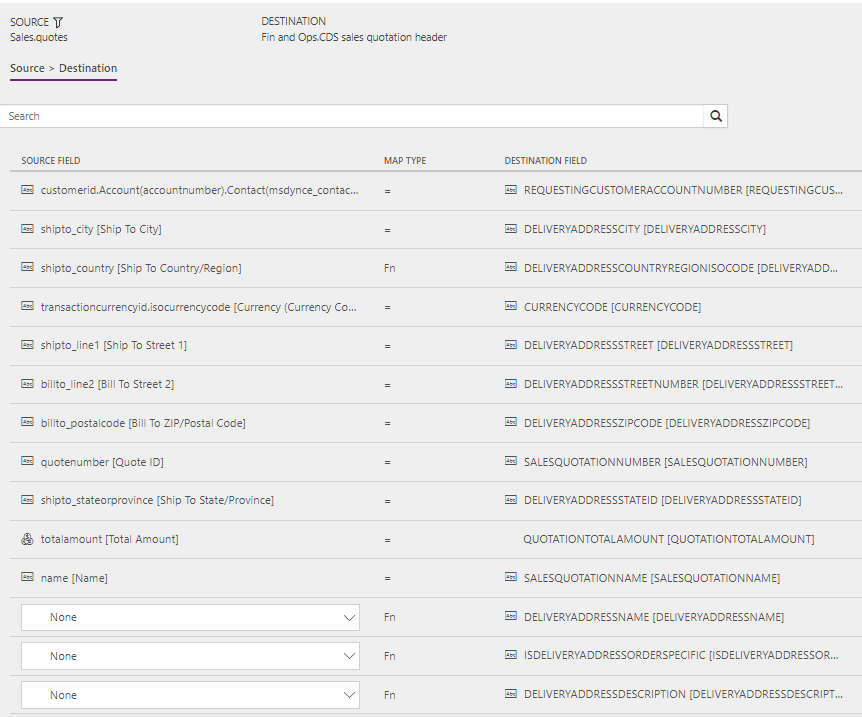
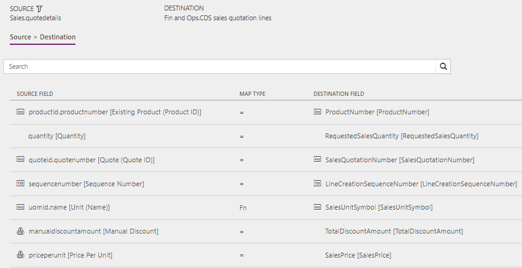

---
# required metadata

title: Synchronize sales quotation headers and lines directly from Sales to Finance and Operations
description: The topic discusses the templates and underlying tasks that are used to synchronize sales quotation headers and lines directly from Microsoft Dynamics 365 for Sales to Microsoft Dynamics 365 for Finance and Operations. 
author: ChristianRytt
manager: AnnBe
ms.date: 10/25/2018
ms.topic: article
ms.prod: 
ms.service: dynamics-ax-applications
ms.technology: 

# optional metadata

ms.search.form: 
# ROBOTS: 
audience: Application User, IT Pro
# ms.devlang: 
ms.reviewer: josaw
ms.search.scope: Core, Operations
# ms.tgt_pltfrm: 
ms.custom: 
ms.assetid: 
ms.search.region: global
ms.search.industry: 
ms.author: crytt
ms.dyn365.ops.version: July 2017 update 
ms.search.validFrom: 2017-07-8

---

# Synchronize sales quotation headers and lines directly from Sales to Finance and Operations

[!include [banner](../includes/banner.md)]

The topic discusses the templates and underlying tasks that are used to synchronize sales quotation headers and lines directly from Microsoft Dynamics 365 for Sales to Microsoft Dynamics 365 for Finance and Operations.

> [!NOTE]
> Before you can use the Prospect to cash solution, you should be familiar with [Integrate data into Common Data Service for Apps](https://docs.microsoft.com/en-us/powerapps/administrator/data-integrator).

## Data flow in Prospect to cash

The Prospect to cash solution uses the Data integration feature to synchronize data across instances of Finance and Operations and Sales. The Prospect to cash templates that are available with the Data integration feature enable the flow of data for accounts, contacts, products, sales quotations, sales orders, and sales invoices between Finance and Operations and Sales. The following illustration shows how the data is synchronized between Finance and Operations and Sales.

## Template and tasks

The following template and underlying tasks are used to synchronize sales quotation headers and lines directly from Sales to Finance and Operations:

- **Name of the template in Data integration:** Sales Quotes (Sales to Fin and Ops) - Direct
- **Names of the tasks in the Data integration project:**

    - QuoteHeader
    - QuoteLine

The following synchronization tasks are required before synchronization of sales quotation headers and lines can occur:

- Products (Fin and Ops to Sales) - Direct
- Accounts (Sales to Fin and Ops) - Direct (if used)
- Contacts to Customers (Sales to Fin and Ops) - Direct (if used)

## Entity set

| Sales        | Finance and Operations     |
|--------------|----------------------------|
| Quotes       | CDS sales quotation header |
| QuoteDetails | CDS sales quotation lines  |

## Entity flow

Sales quotations are created in Sales and synchronized to Finance and Operations.

Sales quotations from Sales are synchronized only if the following conditions are met:

- All quote products on the sales quotation are externally maintained.
- After you click **Activate quote**, the sales quotation is active.

## Prospect to cash solution for Sales

The **Has Externally Maintained Products Only** field has been added to the **Quote** entity to consistently track whether the sales quotation consists entirely of externally maintained products. If a sales quotation has only externally maintained products, the products are maintained in Finance and Operations. This behavior helps guarantee that you don't try to synchronize sales quotation lines that have products that are unknown to Finance and Operations.

All quote products on the sales quotation are updated with the **Has Externally Maintained Products Only** information from the sales quotation header. This information is found in the **Quote Has Externally Maintained Products Only** field on the **QuoteDetails** entity.

A discount can be added to the quote product and will be synchronized to Finance and Operations. The **Discount**, **Charges**, and **Tax** fields on the header are controlled by a setup in Finance and Operations. Currently, this setup doesn't support integration mapping. In the current design, the **Price**, **Discount**, **Charge**, and **Tax** fields are maintained and handled in Finance and Operations.

In Sales, the solution makes the following fields read-only, because the values aren't synchronized to Finance and Operations:

- Read-only fields on the sales quotation header: **Discount %**, **Discount**, and **Freight Amount**
- Read-only fields on quote products: **Tax**

## Preconditions and mapping setup

Before sales quotations are synchronized, it's important that you update the following settings.

### Setup in Sales

- Make sure that permissions are set up for the team that the user from your connection set in Sales is assigned to. If you're using demo data, the user usually has admin access, but the team doesn't have admin access. If the team doesn't have admin access when you run the project from Data integration, you will receive an error message that states that the Principal team is missing.

    To set up permissions for the team, go to **Settings** &gt; **Security** &gt; **Teams**, and select the relevant team. Select **Manage Roles**, and then select a role that has the desired permissions, such as **System Administrator**.

- Go to **Settings** &gt; **Administration** &gt; **System settings** &gt; **Sales**, and make sure that the following settings are used:

    - The **Use system prizing calculation system** option is set to **Yes**.
    - The **Discount calculation method** field is set to **Line item**.

### Setup in the Data integration project

#### QuoteHeader

- Make sure that the required mapping exists for **Shipto\_country** to **DeliveryAddressCountryRegionISOCode**. In the value map, you can define a default value that is used if the value is left blank. Just leave the left side blank, and set the right side to the desired country or region. In this way, you don't have to type the country or region for national orders.

    The template value is a value map where several countries or regions are mapped, and where a blank value equals a value of **US**.

#### QuoteLine

- Make sure that the required value map exists for **SalesUnitSymbol** in Finance and Operations.
- Make sure that the required units are defined in Sales.

    A template value that has a value map is defined for **oumid.name** to **SalesUnitSymbol**.

- Optional: You can add the following mappings to help guarantee that sales quotation lines are imported into Finance and Operations if there is no default information from either the customer or the product:

    - **SiteId** – A site is required in order to generate quotations and sales order lines in Finance and Operations. There is no default template value for **SiteId**.
    - **WarehouseId** – A warehouse is required in order to process quotations and sales order lines in Finance and Operations. There is no default template value for **WarehouseId**.

## Template mapping in data integrator

> [!NOTE]
> - The **Discount**, **Charges**, and **Tax** fields are controlled by a complex setup in Finance and Operations. Currently, this setup doesn't support integration mapping. In the current design, the **Price**, **Discount**, **Charge**, and **Tax** fields are handled by Finance and Operations.
> - The **Payment terms**, **Freight terms**, **Delivery terms**, **Shipping method**, and **Delivery mode** fields aren't part of the default mappings. To map these fields, you must set up a value mapping that is specific to the data in the organizations that the entity is synchronized between.

The following illustrations show an example of a template mapping in data integrator.

### QuoteHeader

### QuoteLine

## Related topics

[Prospect to cash](prospect-to-cash.md)

