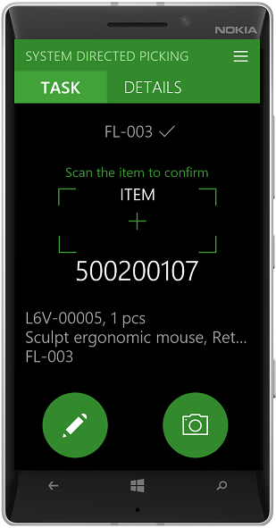
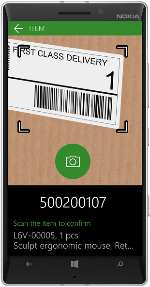

---
# required metadata

title: Scan bar codes using a camera in Dynamics 365 for Finance and Operations – Warehousing
description: This topic explains how to set up Dynamics 365 for Finance and Operations – Warehousing to scan bar codes using a camera on a mobile device. 
author: MarkusFogelberg
manager: AnnBe
ms.date: 01/03/2018
ms.topic: article
ms.prod: 
ms.service: dynamics-ax-applications
ms.technology: 

# optional metadata

ms.search.form: WHSMobileAppField
audience: Application User
# ms.devlang: 
ms.reviewer: josaw
ms.search.scope: Core, Operations
# ms.tgt_pltfrm: 
ms.custom: 269384
ms.search.region: Global
# ms.search.industry: 
ms.author: mafoge
ms.search.validFrom: 2017-01-03
ms.dyn365.ops.version: AX 8.0.0

---

# Scan bar codes using a camera in Dynamics 365 for Finance and Operations – Warehousing

[!include [banner](../includes/banner.md)]

This topic explains how to set up Dynamics 365 for Finance and Operations – Warehousing to scan bar codes using a camera on a mobile device. 

## Prerequisites
To use this feature, you need to have version 1.2.0.0 of Warehousing installed, and your device must have a camera. When you open the app after updating, you will be prompted to allow the Dynamics 365 for Finance and Operations – Warehousing application to use the camera. If your device doesn’t have a camera, no prompt will be shown, and you will not be able to use a camera as a scanner. 

## Setup
In the Display settings of the Warehousing application, you can select if the camera should be used for bar code scanning. If you enable **Use the camera as scanner**, you can use the camera on every input field that has the preferred input mode set to **Scanning**. 

To control whether an input field should be scannable, on the **Warehouse app field names** page in Dynamics 365 for Finance and Operations, set **Preferred input mode** to **Scanning**. When this option is selected, a camera can be used for scanning in the Warehousing app. For information about how to configure app field names in Warehousing, see [Configure app field names in Warehousing app](https://docs.microsoft.com/en-us/dynamics365/unified-operations/supply-chain/warehousing/configure-app-field-names-priorities-warehouse).

## Supported bar code formats
The most common bar code formats are supported, including Code 128, Code 39, Code 93, EAN-8, EAN-13, UPC-E, UPC-A, and QR codes. 

## Navigation
The camera page will be initiated on each page where the input field has the preferred input mode set to Scanning, when you are on the Camera page use the following options to navigate:
- Click the back button to go back to the Task and details page. 
- Click the pencil on the Task and details page to go to the page where you can type input manually.
- Click the camera on the Task and details page to go back to the Camera page. 

| Task and details page | Camera page | 
| :---------------------: | :--------------------: |
|           |           |

On the camera page, when you click the Camera button, it will appear dimmed while trying to identify a bar code. If a bar code is not identified within 5 seconds, the process will time out and the Camera button will become available again. You will then be able to try to scan a bar code again.

When you aim the camera at a bar code, keep the bar code aligned within the brackets for best result. When a bar code is scanned successfully, the result will be processed, and you will be taken to the next step. If the next step contains another input field with the preferred input mode set to Scanning, the camera page will start again. If the next step is not a scanning field, then the camera page will not be initiated.

